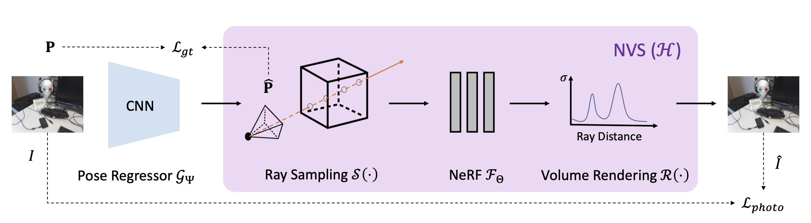

# Direct-PoseNet: Absolute Pose Regression with Photometric Consistency
**[Shuai Chen](https://scholar.google.com/citations?user=c0xTh_YAAAAJ&hl=en), [Zirui Wang](https://scholar.google.com/citations?user=zCBKqa8AAAAJ&hl=en), and [Victor Prisacariu](https://scholar.google.com/citations?user=GmWA-LoAAAAJ&hl=en) (3DV 2021)**

**[Project Page](https://direct-posenet.active.vision) | [Paper](https://arxiv.org/abs/2104.04073)**



## Setup
### Installing Requirements
We tested our code based on CUDA10.1+, PyTorch 1.7.1+, and Python 3.6.9+ using [docker](https://docs.docker.com/engine/install/ubuntu/).

We also used [tensorflow-graphics](https://www.tensorflow.org/graphics) library in our evaluation code for `get_error_in_q()`. **Update**: The dependencies of this package could be easily replaced by the latest pytorch3d library if you wish to run the code without any tensorflow packages.

Rest of dependencies are in requirement.txt

### Data Preparation
- **7Scenes**

We use similar data preparation as in [MapNet](https://github.com/NVlabs/geomapnet). You can download the [7-Scenes](https://www.microsoft.com/en-us/research/project/rgb-d-dataset-7-scenes/) datasets to the `data/deepslam_data` directory.

Or you can use simlink

```sh
cd data/deepslam_data && ln -s 7SCENES_DIR 7Scenes
```

Notice that we additionally computed a pose averaging stats (pose_avg_stats.txt) in `data/7Scenes` to align the 7Scenes' coordinate system with NeRF's coordinate system. You could re-align 

- **LLFF**

You can download the [LLFF dataset](https://drive.google.com/drive/folders/128yBriW1IG_3NJ5Rp7APSTZsJqdJdfc1) via google drive.

```sh
cd data
(DOWNLOAD nerf_llff_data.zip into data/)
unzip nerf_llff_data.zip
cd ..
```

## Training

Our method relies on a pretrained NeRF model and a pretrained pose regression model as we stated in the paper. The followings are examples to train the models.

- NeRF model (7-Scenes)

```sh
python run_nerf.py --config config_nerf.txt
```

- NeRF model (LLFF)

```sh
python run_nerf.py --config configs/fern.txt
```

- Pose regression baseline model

```sh
python train.py --config config_pn.txt
```

- Direct-PoseNet model

```sh
python train.py --config config_direct_pn.txt
```

- Direct-PoseNet + Unlabeled model

```sh
python train.py --config config_direct_pn_unlabel.txt
```

## Evaluation

We provide methods to evaluate our direct-pn and direct-pn+U models.

- To evaluate the NeRF model in PSNR, simply add `--render_test` argument. To save rendered images as videos, add `--render_video_train` or `--render_video_test`

```sh
python run_nerf.py --config config_nerf.txt --render_test
```

- To evaluate APR performance of the pose regression baseline model, Direct-pn, or Direct-pn+U model, you can just add `--eval --testskip=1 --pretrain_model_path=../logs/PATH_TO_CHECKPOINT`. For example:

```sh
python train.py --config config_direct_pn.txt --eval --testskip=1 --pretrain_model_path=../logs/direct_pn_heads/checkpoint.pt
```

## Pre-trained model
You can download our paper models using the link below.

(Coming Soon)

## Acknowledgement
We thank Kejie Li for his advice on experimental design and generous help to polish our paper. We also appreciate Henry Howard-Jenkins and Theo W. Costain for some great comments and discussions.

Our NeRF code is modified based on [nerf-pytorch](https://github.com/yenchenlin/nerf-pytorch). Thanks for their excellent work!

## Citation
```
@inproceedings{chen2021direct,
  title={Direct-PoseNet: Absolute pose regression with photometric consistency},
  author={Chen, Shuai and Wang, Zirui and Prisacariu, Victor},
  booktitle={2021 International Conference on 3D Vision (3DV)},
  pages={1175--1185},
  year={2021},
  organization={IEEE}
}
```
